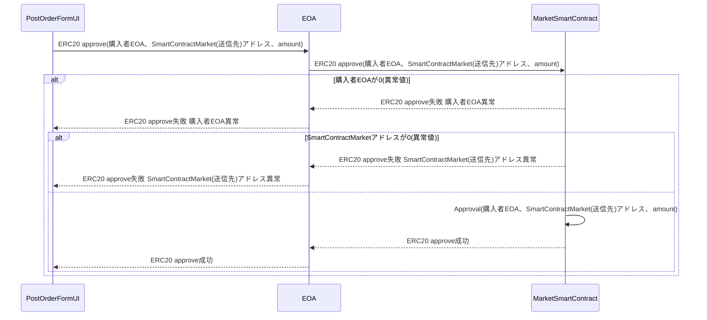

```mermaid

sequenceDiagram
    participant PostOrderFormUI
    participant EOA
    participant MarketSmartContract
    PostOrderFormUI->>EOA:ERC20 approve(購入者EOA、SmartContractMarket(送信先)アドレス、amount)
    EOA->>MarketSmartContract:ERC20 approve(購入者EOA、SmartContractMarket(送信先)アドレス、amount)
    alt 購入者EOAが0(異常値)
        MarketSmartContract-->>EOA: ERC20 approve失敗 購入者EOA異常
        EOA-->>PostOrderFormUI: ERC20 approve失敗 購入者EOA異常
        alt SmartContractMarketアドレスが0(異常値)
            MarketSmartContract-->>EOA:ERC20 approve失敗 SmartContractMarket(送信先)アドレス異常
            EOA-->>PostOrderFormUI:ERC20 approve失敗 SmartContractMarket(送信先)アドレス異常
        else
            MarketSmartContract->>MarketSmartContract:Approval(購入者EOA、SmartContractMarket(送信先)アドレス、amount)
            MarketSmartContract-->>EOA:ERC20 approve成功
            EOA-->>PostOrderFormUI:ERC20 approve成功

        end
    end
```
