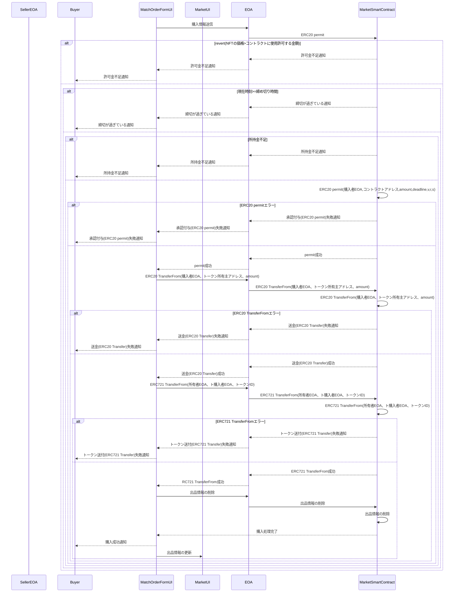

```mermaid
sequenceDiagram
    participant SellerEOA
    participant Buyer
    participant MatchOrderFormUI
    participant MarketUI
    participant EOA
    participant MarketSmartContract
    MatchOrderFormUI->>EOA: 購入情報送信
    EOA->>MarketSmartContract: ERC20 permit
    alt revert(NFTの価格>コントラクトに使用許可する金額)
        MarketSmartContract-->>EOA: 許可金不足通知
        EOA-->>MatchOrderFormUI: 許可金不足通知
        MatchOrderFormUI-->>Buyer: 許可金不足通知
    else
        alt 現在時刻>=締め切り時間
                MarketSmartContract-->>EOA:締切が過ぎている通知
                EOA-->>MatchOrderFormUI:締切が過ぎている通知
                MatchOrderFormUI-->>Buyer: 締切が過ぎている通知
        else
            alt 所持金不足
                MarketSmartContract-->>EOA: 所持金不足通知
                EOA-->>MatchOrderFormUI: 所持金不足通知
                MatchOrderFormUI-->>Buyer: 所持金不足通知
            else
                MarketSmartContract->>MarketSmartContract:ERC20 permit(購入者EOA,コントラクトアドレス,amount,deadline,v,r,s)
                alt ERC20 permitエラー
                    MarketSmartContract-->>EOA: 承認付与(ERC20 permit)失敗通知
                    EOA-->>MatchOrderFormUI: 承認付与(ERC20 permit)失敗通知
                    MatchOrderFormUI-->>Buyer: 承認付与(ERC20 permit)失敗通知
                else
                    MarketSmartContract-->>EOA: permit成功
                    EOA-->>MatchOrderFormUI: permit成功
                    MatchOrderFormUI->>EOA:ERC20 TransferFrom(購入者EOA、トークン所有主アドレス、amount)
                    EOA->>MarketSmartContract:ERC20 TransferFrom(購入者EOA、トークン所有主アドレス、amount)
                    MarketSmartContract->>MarketSmartContract:ERC20 TransferFrom(購入者EOA、トークン所有主アドレス、amount)
                    alt ERC20 TransferFromエラー
                        MarketSmartContract-->>EOA: 送金(ERC20 Transfer)失敗通知
                        EOA-->>MatchOrderFormUI: 送金(ERC20 Transfer)失敗通知
                        MatchOrderFormUI-->>Buyer: 送金(ERC20 Transfer)失敗通知
                    else
                        MarketSmartContract-->>EOA: 送金(ERC20 Transfer)成功
                        EOA-->>MatchOrderFormUI: 送金(ERC20 Transfer)成功

                        MatchOrderFormUI->>EOA:ERC721 TransferFrom(所有者EOA、ト購入者EOA、トークンID)                                                 
                        EOA->>MarketSmartContract:ERC721 TransferFrom(所有者EOA、ト購入者EOA、トークンID)
                        MarketSmartContract->>MarketSmartContract:ERC721 TransferFrom(所有者EOA、ト購入者EOA、トークンID)
                        alt ERC721 TransferFromエラー
                            MarketSmartContract-->>EOA:トークン送付(ERC721 Transfer)失敗通知
                            EOA-->>MatchOrderFormUI:トークン送付(ERC721 Transfer)失敗通知
                            MatchOrderFormUI-->>Buyer: トークン送付(ERC721 Transfer)失敗通知
                        else
                            MarketSmartContract-->>EOA:ERC721 TransferFrom成功
                            EOA-->>MatchOrderFormUI:RC721 TransferFrom成功
                            MatchOrderFormUI->>EOA:出品情報の削除
                            EOA->>MarketSmartContract:出品情報の削除
                            MarketSmartContract->>MarketSmartContract:出品情報の削除
                            MarketSmartContract-->>MatchOrderFormUI:購入処理完了
                            MatchOrderFormUI-->>Buyer: 購入成功通知
                            MatchOrderFormUI->>MarketUI:出品情報の更新
                        end
                    end
                end
            end
        end
    end
```
