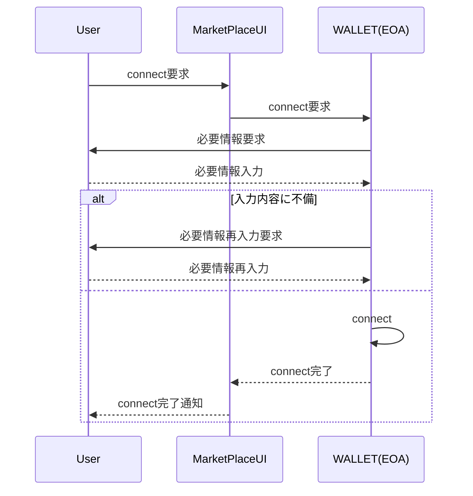

```mermaid
sequenceDiagram
    participant User
    participant MarketPlaceUI
    participant WALLET(EOA)
    User->>MarketPlaceUI: connect要求
    MarketPlaceUI->>WALLET(EOA): connect要求
    WALLET(EOA)->>User: 必要情報要求
    User-->>WALLET(EOA): 必要情報入力
    alt 入力内容に不備
        WALLET(EOA)->>User: 必要情報再入力要求
        User-->>WALLET(EOA): 必要情報再入力
    else
        WALLET(EOA)->>WALLET(EOA): connect
        WALLET(EOA)-->>MarketPlaceUI: connect完了
        MarketPlaceUI-->>User: connect完了通知
    end
```

