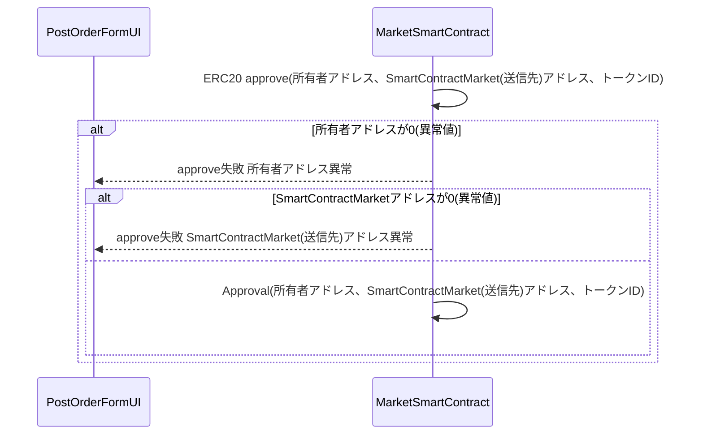

```mermaid
sequenceDiagram
    participant PostOrderFormUI
    participant MarketSmartContract
    MarketSmartContract->>MarketSmartContract:ERC20 approve(所有者アドレス、SmartContractMarket(送信先)アドレス、トークンID)
    alt 所有者アドレスが0(異常値)
        MarketSmartContract-->>PostOrderFormUI: approve失敗 所有者アドレス異常
        alt SmartContractMarketアドレスが0(異常値)
            MarketSmartContract-->>PostOrderFormUI: approve失敗 SmartContractMarket(送信先)アドレス異常
        else
            MarketSmartContract->>MarketSmartContract:Approval(所有者アドレス、SmartContractMarket(送信先)アドレス、トークンID)
        end
    end
```
