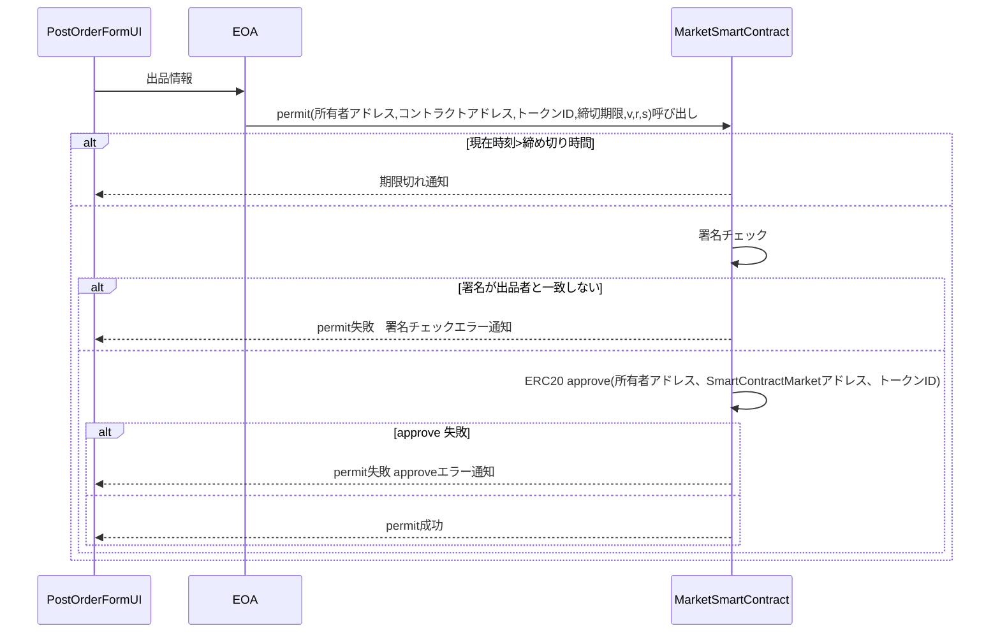

```mermaid
sequenceDiagram
    participant PostOrderFormUI
    participant EOA
    participant MarketSmartContract
    PostOrderFormUI->>EOA: 出品情報
    EOA->>MarketSmartContract: permit(所有者アドレス,コントラクトアドレス,トークンID,締切期限,v,r,s)呼び出し
            alt 現在時刻>締め切り時間
                MarketSmartContract-->>PostOrderFormUI: 期限切れ通知
            else
                MarketSmartContract->>MarketSmartContract: 署名チェック
                alt 署名が出品者と一致しない
                    MarketSmartContract-->>PostOrderFormUI: permit失敗　署名チェックエラー通知
                else
                    MarketSmartContract->>MarketSmartContract:ERC20 approve(所有者アドレス、SmartContractMarketアドレス、トークンID)
                    alt approve 失敗
                        MarketSmartContract-->>PostOrderFormUI: permit失敗 approveエラー通知

                    else
                        MarketSmartContract-->>PostOrderFormUI: permit成功
                    end
                end
            end
```
