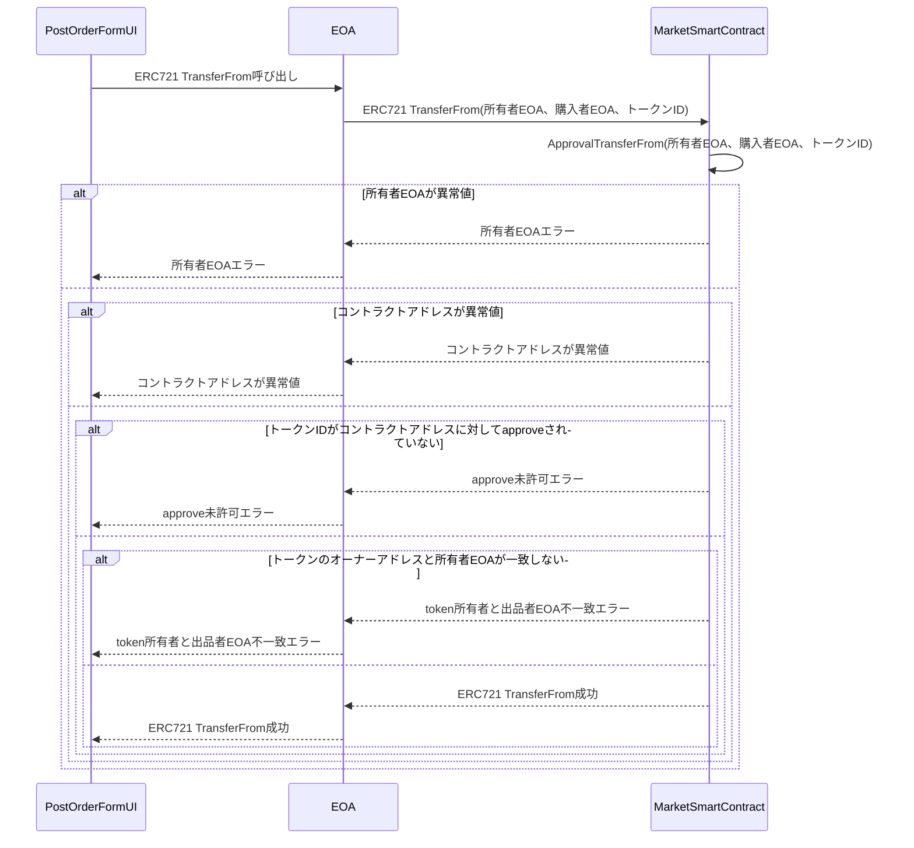

```mermaid

sequenceDiagram
    participant PostOrderFormUI
    participant EOA
    participant MarketSmartContract
    PostOrderFormUI->>EOA:ERC721 TransferFrom呼び出し
    EOA->>MarketSmartContract:ERC721 TransferFrom(所有者EOA、購入者EOA、トークンID)
    MarketSmartContract->>MarketSmartContract:ApprovalTransferFrom(所有者EOA、購入者EOA、トークンID)
    alt 所有者EOAが異常値
        MarketSmartContract-->>EOA:所有者EOAエラー
        EOA-->>PostOrderFormUI:所有者EOAエラー
    else
        alt コントラクトアドレスが異常値
            MarketSmartContract-->>EOA:コントラクトアドレスが異常値
            EOA-->>PostOrderFormUI:コントラクトアドレスが異常値
        else
            alt トークンIDがコントラクトアドレスに対してapproveされていない
                MarketSmartContract-->>EOA:approve未許可エラー
                EOA-->>PostOrderFormUI:approve未許可エラー
            else
                alt トークンのオーナーアドレスと所有者EOAが一致しない
                    MarketSmartContract-->>EOA:token所有者と出品者EOA不一致エラー
                    EOA-->>PostOrderFormUI:token所有者と出品者EOA不一致エラー
                else
                    MarketSmartContract-->>EOA:ERC721 TransferFrom成功
                    EOA-->>PostOrderFormUI:ERC721 TransferFrom成功
                end
            end
        end
    end
```
