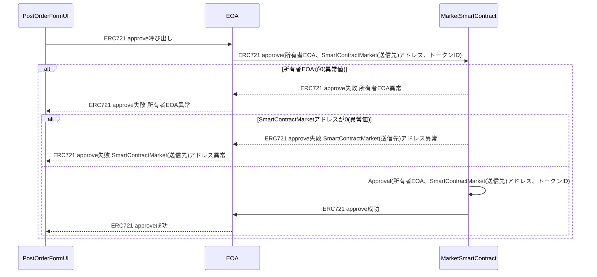

```mermaid

sequenceDiagram
    participant PostOrderFormUI
    participant EOA
    participant MarketSmartContract
    PostOrderFormUI->>EOA:ERC721 approve呼び出し
    EOA->>MarketSmartContract:ERC721 approve(所有者EOA、SmartContractMarket(送信先)アドレス、トークンID)
    alt 所有者EOAが0(異常値)
        MarketSmartContract-->>EOA: ERC721 approve失敗 所有者EOA異常
        EOA-->>PostOrderFormUI: ERC721 approve失敗 所有者EOA異常
        alt SmartContractMarketアドレスが0(異常値)
            MarketSmartContract-->>EOA:ERC721 approve失敗 SmartContractMarket(送信先)アドレス異常
            EOA-->>PostOrderFormUI:ERC721 approve失敗 SmartContractMarket(送信先)アドレス異常
        else
            MarketSmartContract->>MarketSmartContract:Approval(所有者EOA、SmartContractMarket(送信先)アドレス、トークンID)
            MarketSmartContract->>EOA:ERC721 approve成功
            EOA-->>PostOrderFormUI:ERC721 approve成功

        end
    end
```
